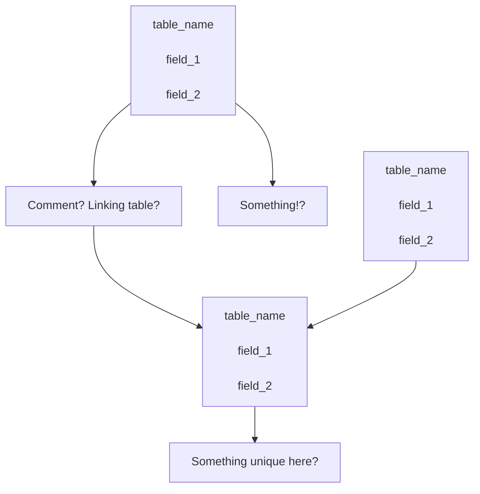

## Markdown extended syntax
put notes here regarding markdown's extended syntax

## Discrepancies
Put notes here about some discpeancies between viewers, e.g.:
- Need two blank new lines to actually separate text onto a new line in GitHub (and I think GitLab too)

## Database design
I'm considering using this myself, since I've always wanted a "YAFIYGI" style way to design databases. Design meaning conceptually marking up the fields (such as https://draw.io and Visio), but not something that directly maps to MySQL (such as phpMyAdmin and MySQL Workbench).

The way I saw this could potentially be done (via a semi-unrelated use case), is with codeblocks using `mermaid`, however it's incredibly cumbersome - there might be some syntax here that could be useful, or a different markup language even.

<mark>As it turns out, the codeblock below is not supported on GitHub</mark>

