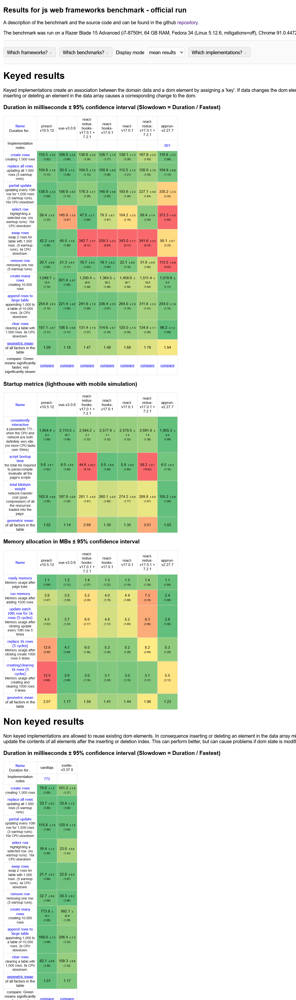

Using more or less the same code, which was initially written in Preact.

This file assumes no other variables, obviously; some people claim that Preact suffers from incomplete compatibility with the React ecosystem, or that it actually performs worse in different scenarios, but I'm not here to prove or disprove that. What I'm simply saying is React is diabolically massive.

| Library     |  Style     | Characters  | Source |
| ----------- | -------    | ----------- | ---------------- |
| Preact      | Functional | 13238       | preact-react\preact-test-size\build-func\bundle.1b1f1.js  |
| Preact      | Class      | 12673       | preact-react\preact-test-size\build-class\bundle.d0db5.js  |
| React       | Functional | 132153      | preact-react\react-test-size\build-func\static\js\2.078a58b1.chunk.js  |
| React       | Class      | 134114      | preact-react\react-test-size\build-class\static\js\2.8accee3b.chunk.js  |

See for performance: https://krausest.github.io/js-framework-benchmark/2021/table_chrome_91.0.4472.77.html

Here's a screenshot (mildly worried about the memory usage for preact)

